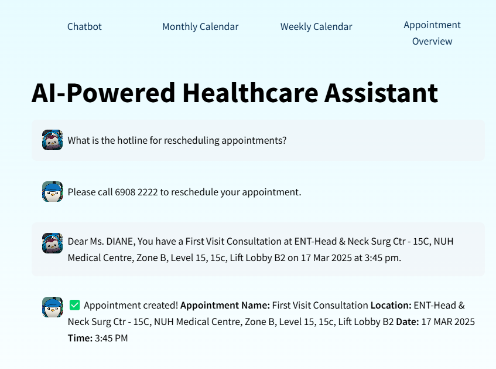

# HealthHive AI-Powered Healthcare Assistant

An intelligent healthcare assistant that combines appointment scheduling capabilities with general healthcare queries using Large Language Models (LLM) and Google Calendar integrations.



## Core Features

### 1. Unified Agent System
Uses LangChain's agent framework to route queries between multiple tools:

- **Appointment Scheduling**: Automatically extracts details and creates Google Calendar events.
- **General Healthcare Queries**: Provides contextual responses using conversation memory.
- **Appointment Enquiry**: Answers appointment-related questions using InterSystems IRIS for Health.
- **OCR Functionality**: Extracts text from SMS or screenshots for seamless appointment management.

## Technical Architecture

### LLM Integration
- **Model**: Google’s Gemini 2.0 Flash Lite Preview (via OpenRouter).
- **Purpose**: 
  - Natural language understanding
  - Query classification
  - Response generation
  - Appointment detail extraction

### Agentic System
Uses two main tools:
1. **Schedule_Appointment Tool**
   - Triggers when messages start with "Dear" or contain appointment details
   - Extracts key details (date, time, location, type) using LLM.
   - Creates Google Calendar events and returns formatted confirmations.

2. **General_Chat Tool**
   - Handles all non-appointment queries
   - Provides personalized healthcare support using contextual memory.

3. **Appointment_Enquiry Tool**
   - Answers appointment-related questions using InterSystems IRIS for Health.
   - Retrieves relevant information from the database.

4. **OCR Functionality**
   - Extracts text from SMS or screenshots.
   - Passes extracted details to the scheduling system.

### InterSystems IRIS Database Integration
- Stores vectorized healthcare data for efficient retrieval.
- Enables Retrieval Augmented Generation (RAG) for accurate, context-aware responses.
- Provides a unified view of patient progress across multiple providers.

### Calendar Integration
- Uses Google Calendar API for event creation
- OAuth 2.0 authentication
- Automatic token refresh handling

### User Interface
- Built with Streamlit
- Features:
  - Chat interface
  - Message preview before sending
  - Example prompts in sidebar
  - Formatted appointment confirmations

## How It Works

1. **User Input Processing**
   ```
   User Message → Unified Agent → Tool Selection → Response Generation
   ```

2. **Appointment Flow**
   ```
   Appointment Request → LLM Extraction → Calendar Creation → Confirmation
   ```

3. **Query Flow**
   ```
   Healthcare Query → LLM Processing → Context Integration → Response
   ```

4. **OCR Flow**
   ```
   SMS/Screenshot → OCR Extraction → LLM Processing → Calendar Creation → Confirmation
   ```

## Setup Guide

### 1. Get OpenRouter API Key
- Obtain your OpenRouter API key and store it in the `.env` file as `OPENROUTER_API_KEY`.

### 2. Clone the Repository
```bash
git clone https://github.com/intersystems-community/hackathon-2024.git
cd hackathon-2024
```

### 3. Install Intersystems IRIS Community Edition
Install IRIS Community Edition in a container. This will be your SQL database server.
```bash
docker run -d --name iris-comm -p 1972:1972 -p 52773:52773 -e IRIS_PASSWORD=demo -e IRIS_USERNAME=demo intersystemsdc/iris-community:latest
```
After running the above command, you can access the System Management Portal via [http://localhost:52773/csp/sys/UtilHome.csp](http://localhost:52773/csp/sys/UtilHome.csp).

### 4. Google Calendar Setup
#### 4A. Google Calendar Setup
1. Go to [Google Cloud Console](https://console.cloud.google.com/)
2. Create a new project
3. Enable Google Calendar API
4. Create OAuth 2.0 credentials (API & Services > Crendentials)
5. Create Credentials, Create OAuth client ID, and select Web application
6. Add `http://localhost:8080/` to the Authorized redirect URIs
7. Download the credentials JSON file
8. Store this JSON credentials file in the root directory of this project
9. Rename the JSON file to `credentials.json`

#### 4B. Google Calendar iFrame Setup
1. Go to [Google Calendar](https://calendar.google.com/)
2. Create a new calendar for the application (if required)
3. Click Setting icon (top right corner) > Settings for my calenders > Select the calendar you've created > Make available to public
4. Go to Integrate calendar > Customize
5. Set the details to show- recommended settings: Only show 'Navigation Button' and 'Date', set the width to own preference, select only the calendar to display
6. Copy the iFrame code for Default view (Month, Week, Schedule) and paste it into the `streamlit.py` file line21 onwards. (to be refactored.)
### 5. Create Environment
Create a Python environment and activate it (conda, venv, or however you wish). For example:

**NOTE:** The DB-API driver .whl files might only work with Python 3.8 to 3.12. If you get an error while installing those files, you will have to create a virtual environment with a specific Python version like `python3.12 -m venv myenv`.

**Conda:**
```bash
conda create --name iris-env python=3.10
conda activate iris-env
```

**venv (Mac):**
```bash
python3 -m venv iris-env
source iris-env/bin/activate
```

**venv (Windows):**
```bash
python3 -m venv iris-env
.\iris-env\Scripts\Activate
```

**venv (Unix):**
```bash
python -m venv iris-env
source ./iris-env/bin/activate
```

### 6. Install Packages for All Demos
**Note:** This command might take a while to run (as it freezes for some time which looks like it's stuck):
```bash
pip install -r requirements.txt
```

### 7. Install Intersystems DB API Driver
Choose one option based on your Operating System. Usage of the driver is subject to Terms and Conditions.

**Mac OS:**
```bash
pip install ./install/intersystems_irispython-5.0.1-8026-cp38.cp39.cp310.cp311.cp312-cp38.cp39.cp310.cp311.cp312-macosx_10_9_universal2.whl
```

**Windows AMD64:**
```bash
pip install ./install/intersystems_irispython-5.0.1-8026-cp38.cp39.cp310.cp311.cp312-cp38.cp39.cp310.cp311.cp312-win_amd64.whl
```

**Windows 32:**
```bash
pip install ./install/intersystems_irispython-5.0.1-8026-cp38.cp39.cp310.cp311.cp312-cp38.cp39.cp310.cp311.cp312-win32.whl
```

**Linux aarch64:**
```bash
pip install ./install/intersystems_irispython-5.0.1-8026-cp38.cp39.cp310.cp311.cp312-cp38.cp39.cp310.cp311.cp312-manylinux_2_17_aarch64.manylinux2014_aarch64.whl
```

**Linux x86_64:**
```bash
pip install ./install/intersystems_irispython-5.0.1-8026-cp38.cp39.cp310.cp311.cp312-cp38.cp39.cp310.cp311.cp312-manylinux_2_17_x86_64.manylinux2014_x86_64.whl
```

### 8. Using the Management Portal
1. Navigate to [http://localhost:52773/csp/sys/UtilHome.csp](http://localhost:52773/csp/sys/UtilHome.csp), login with username: `demo`, password: `demo` (or whatever you configured).
2. Change the namespace (on the top left) from `%SYS` to `USER`.
3. On the left navigation pane, click 'System Explorer'.
4. Click 'SQL' -> 'Go'.
5. Here, you can execute SQL queries. You can also view the tables by clicking the relevant table on the left, under 'Tables', and then clicking 'Open Table' (above the SQL query box).

## Requirements Installation

1. Clone this repository
2. Install the required packages using:
```bash
pip install -r requirements.txt
```
This should download all the dependencies for the running of this application.

## Running the Application

1. Ensure the IRIS container is running in the background.
2. Start the Streamlit application:
```bash
streamlit run streamlit.py
```
3. The application will open at `http://localhost:8501`.
4. First-time users will be prompted to authenticate with Google Calendar.

## Troubleshooting
- If you get OpenRouter connection errors, ensure your API key is set correctly in the `.env` file.
- If calendar events aren't creating, check your Google Calendar permissions.
- For authentication issues, delete `token.pickle` and restart the application.

## System Requirements
- Python 3.12+
- Windows/Mac/Linux OS
- Internet connection for Google Calendar API
- Minimum 8GB RAM recommended for OpenRouter

Project References:

[You'll never create calendar events manually again after today - here's why](https://khayrul-rules.medium.com/youll-never-create-calendar-events-manually-again-after-today-here-s-why-52427c6e06cb)